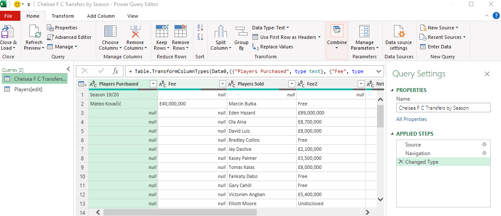

# Roman Abramovich's Chelsea First Team Signings: An Overview of Performance

## Objective
The objective of this project is to provide an overview of the first-team signings who have made at least one Premier League appearance during Roman Abramovich's tenure as the owner of Chelsea Football Club and analyze their performance.

## Data Gathering
To gather the necessary data for this project, I utilized Power Query in Microsoft Excel to scrape data from worldfootball.net, transferleague.co.uk, and wikipedia.org. Prior to gathering the data, I had a clear idea of the metrics I wanted to showcase and how I intended to present them.   

 
Using Power Query, I extracted multiple tables containing the relevant data from the websites mentioned above. Specifically, I obtained Chelsea FC's transfer history and player appearances. As my focus was on the Abramovich era, I extracted data from 2003 to 2022. I created a new table specifically for first-team signings, which included features such as player name, transfer fee, previous club, position, league, season, coach, Premier League (PL) appearances, PL goals, and total appearances. Additionally, I created another table to track first-team players who were sold, containing features such as player name, transfer fee, the club transferred to, league, position, season, and coach.  
 
 
 

## Data Processing
Power Query was instrumental in gathering and organizing the data from the websites. I employed VLOOKUP to link values from different tables, such as coach, goals, and appearances. To handle cases where players had no goals for the club, I combined the IFERROR formula with VLOOKUP to prevent errors. 
 
  
 
  
 

## Data Analysis
For statistical operations, I utilized pivot tables. The calculations and insights were then visualized through pivot charts. I also designed a dashboard to present all the relevant metrics required for the analysis. The dashboard incorporated a pitch design, created using built-in shapes (line, rectangle, oval, arrow) available in the Insert tab. Images used in the dashboard were sourced from images.google.com.
 

## Challenges
One of the challenges encountered during the project was integrating data from different sources. It was crucial to establish connections between the various datasets. I used player names as unique identifiers but faced difficulties with name spelling. For example, the full name of Mikel differed between the websites, with one spelling it as "John Obi Mikel" and the other as "John Mikel Obi." Additionally, diacritics in names, such as Kanté and Kovačić, posed further issues. To overcome these challenges, it was necessary to ensure consistency in player names across tables, enabling the effective use of lookup functions.
 
 

In conclusion, this project aimed to analyze the first team signings during Roman Abramovich's ownership of Chelsea FC. Through data gathering, processing, and analysis using tools like Power Query, VLOOKUP, and pivot tables, meaningful insights were derived and presented in a comprehensive static dashboard.

Thank you for reading!
